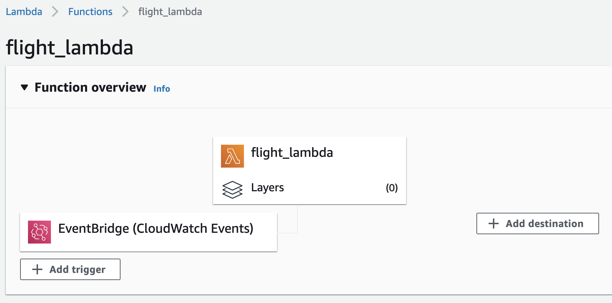
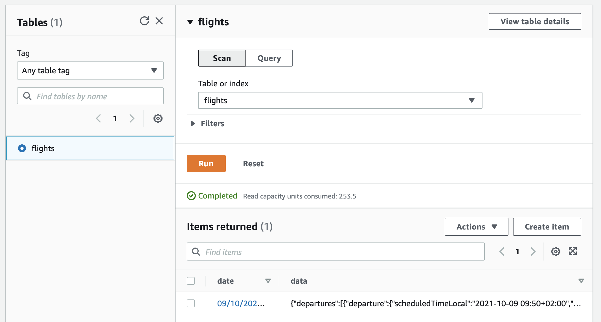

# AeroDataBox

Die AeroDataBox API wird hier beschrieben: https://www.aerodatabox.com/.

Alle zwei Stunden werden die Abflüge der letzten zwei Stunden abgefragt und in einer DynamoDB Datenbank gespeichert.

## Spezifika dieser Quelle

Die Basic Version dieser Schnittstelle ist auf 200 Endpoints pro Monat limitiert. Deshalb haben wir uns dazu entschieden, dass jeder von uns eine Lambda Funktion erstellt und die Daten von nur einem Flughafen sammelt.

Der Code unterscheidet sich dabei im Wesentlichen nur an folgender Stelle:

`conn.request("GET", f"/flights/airports/icao/EHAM/{from_}/{to_}?withLeg=true&withCancelled=true&withCodeshared=true&withCargo=true&withPrivate=true&withLocation=false", headers=headers)`

Es muss lediglich der Flughafencode angepasst werden: `icao/<Flughafencode>/`

## DynamoDB Datenbank

Als Primary Key wurde das Datum inkl. Uhrzeit gewählt. Als Value werden die abgefragten JSON Elemente als String gespeichert.

