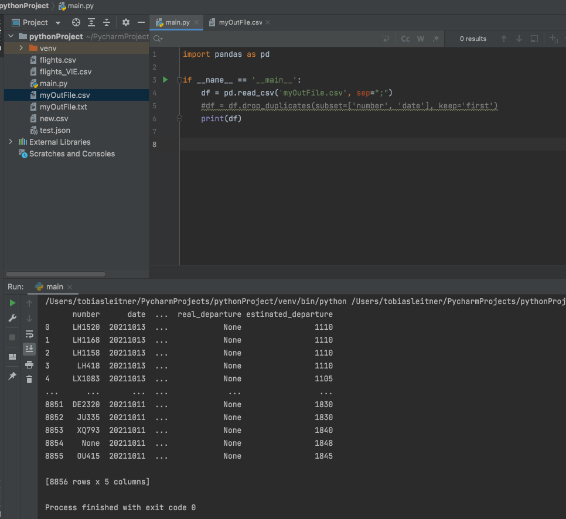
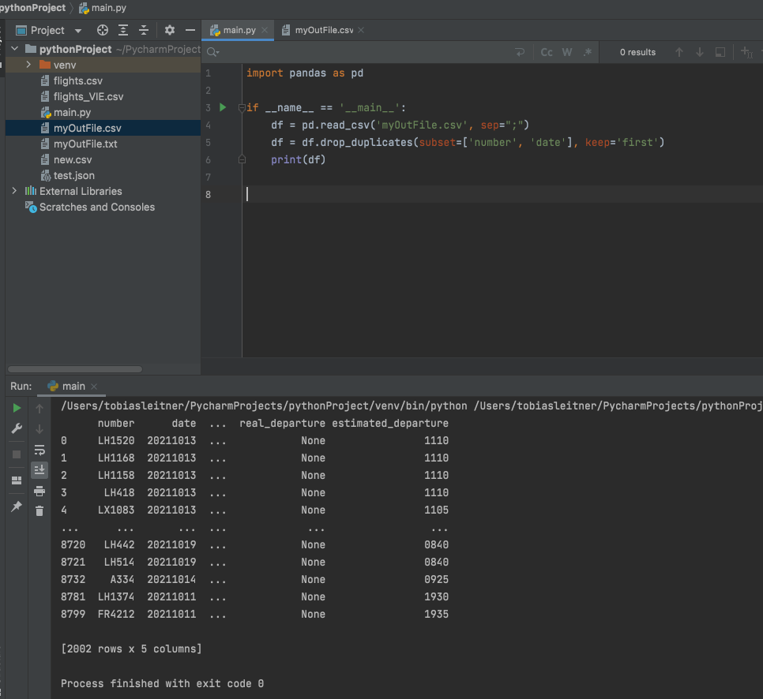

# Flightradar24

[Flightradar24.com](https://www.flightradar24.com/) ist ein Onlinedienst zur Echtzeit-Positionsdarstellung von Flugzeugen. Er wird von dem in Stockholm ansässigen Unternehmen Flightradar24 AB betrieben.

## pyflightdata API

* [API Dokumentation](https://pyflightdata.readthedocs.io/en/latest/pyflightdata.html)

* Lambda Layer (dependencies): `./code/python.zip`

### Relevante Methoden

Abflüge auf einem bestimmten Flughafen: `get_airport_departures(iata, page=1, limit=100, earlier_data=False)`

Wetter auf dem Flughafen: `get_airport_weather(iata, page=1, limit=100)`

Flughistorie für einen bestimmten Flug: `get_all_available_history_by_flight_number(flight_number, delay=1)`

## Spezifika dieser Quelle

Ein Problem dieser Schnittstelle ist folgendes: Man kann hier leider kein Zeitintervall auswählen, für das man die Flüge abfragen möchte. Deshalb erfolgte eine Schätzung (auf Basis der veröffentlichten [Daten und Fakten](https://www.fraport.com/de/konzern/ueber-uns/zahlen--daten-und-fakten1.html) des Frankfurter Flughafens), wie viele Flugzeuge pro Stunde abheben. Es finden ungefähr 1400 Flüge in 24 Stunden statt. Das entspricht wahrscheinlich 700 Abflüge in 24 Stunden und 30 Abflüge pro Stunde. Dabei muss man beachten, dass der Großteil der Flüge zwischen 9:00 und 21:00 stattfinden (siehe Flightradar). Es wird also ein Abfrage-Intervall von 10 Minuten im Zeitraum 9:00 bis 21:00 festgelegt, in dem jeweils 10 Flüge abgefragt werden. Überflüssige Flüge müssen dann im Nachhinein bereinigt werden.

## Ansatz

1) Abfüge von einem bestimmten Flughafen abfragen. (Achtung: Spezifika dieser Quelle beachten)
2) Flughistorie eines Flugs abfragen. Nur sinnvoll, wenn kostenpflichtig die Daten für ein Jahr abgefragt werden.

## Relevante Attribute extrahieren und Datacleaning

Die Extraktion der relevanten Attribute und das Datencleaning gestalten sich bei dieser Quelle wesentlich schwieriger. Vom Prinzip wird wieder gleich vorgegangen wie bei der Aerodatabox Quelle. Das Problem hier besteht primär darin, dass der Json String, der von der Schnittstelle zurückgegeben wird und in der Datenbank gespeichert wird, kein gültiges Json Format ist. Anstatt double quotes werden single quotes verwendet. Somit war es im ersten Schritt notwendig, die single quotes mit double quotes zu ersetzen:

`string = string.replace("\'", "\"")`

Trotz dieser Anpassung war der Json Output noch immer nicht im richtigen Format. Dank der genauen Fehlerbeschreibung auf der Konsole, konnte herausgefunden werden, dass der Fehler bei den Keywords True und False lag. Diese wurden völlig ohne quotes abgespeichert. 

`string = string.replace("True", "\"True\"")`
`string = string.replace("False", "\"False\"")`

Auch nach dieser Anpassung konnte der string nicht mittels `json.loads(string)` in ein json umgewandelt werden. 

Grund dafür war folgendes Problem: Es gibt Flughäfen mit singlequotes im Namen. Diese wurden nun auch durch doublequotes ersetzt und führten somit zu einem ungültigen Json Objekt. BSP:  `"name": "Chicago O"Hare International Airport"`

Lösung: Da es in diesem Json immer wieder zu Problemen kommt, wird folgende Lösung implementiert. Die Umwandlung des Strings erfolgt in einem Try Except Block und falls eine Exception geworfen wird, wird eine eigens dafür implementierte Counter erhöht. Dieser Counter wird zum Schluss auf der Konsole ausgegeben. Dadurch kann man kontrollieren, wieviel Daten nicht umgewandelt werden konnten. In einem Testlauf wurden 4 Datenbankeinträge aussortiert, wo in etwa maximal 40 Flüge enthalten sind. In die csv Datei wurden über 460 Flüge trotzdem eingetragen (obwohl hier noch weitere Bereinigungen dazwischen stattgefunden haben).

Jene Strings, die nun erfolgreich in ein Json Objekt umgewandelt werden konnten, werden nun weiter überprüft, ob auch wirklich die notwendigen Inhalte vorhanden sind. Falls dies nicht zutrifft, werden diese ebenso aussortiert. 

### Duplikate aussortieren

Da bei dieser Quelle alle 10 Minuten die Daten abgefragt werden und man kein Zeitintvervall spezifizieren konnte, gibt es bei dieser Quelle sehr viele Duplikate. Mittels `pandas` wurde das csv File eingelesen und mit der Methode `df = df.drop_duplicates(subset=['number', 'date'], keep='first')` gefiltert. Wenn Flugnummer und Datum in der selben Kombination mehrfach vorkommen, dann wird nur ein Element behalten.

Von den fast 9000 eingelesenen Flügen bleiben für den Flughafen Frankfurt ca 2000 Flüge über.

Nicht gefiltert: 

Gefiltert:

