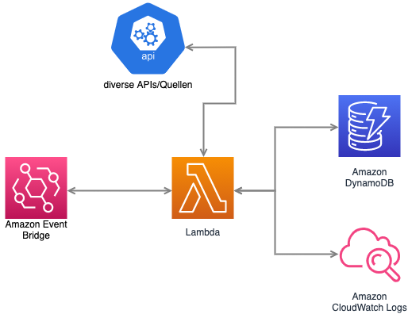
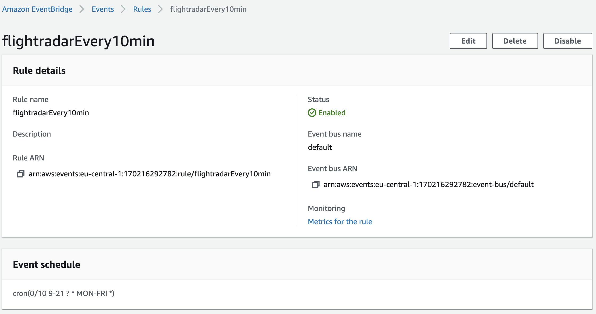

# IT-Projekt

Ziel dieses Projekts ist es, die Delay‐Targets für Linienflüge basierend auf der Variabilität der Abflugzeiten abzuschätzen.

## Aufgabe 1

### Aufgabenbeschreibung

Im ersten Paket hatten wir die Aufgabe, geeignete Datenquellen zu identifizieren, Daten zu sammeln und die relevaten Attribute zu identifizieren. Desweitern setzten wir uns mit der Validierung der Daten auseinander.
Datenquellen identifizieren

#### Datenquellen identifizieren

| Name | Github Referenz | Website |
|---|---|---|
| Flightradar24 | [/Flightradar24](./Flightradar24) | https://www.flightradar24.com/ |
| AeroDataBox | [/AeroDataBox](./Aerodatabox_API) | https://www.aerodatabox.com/ |

##### Schnittstellendefinition

* [Flightradar24](./Flightradar24/README.md)
* [AeroDataBox](./Aerodatabox_API/README.md)

#### Daten sammeln

##### Architekturdokumentation: AWS

Als Infrastruktur für die Datensammlung wählten wir AWS, den Cloud Service von Amazon aus. Der Code für die Datensammlung wird in AWS Lambda Funktionen ausgeführt und die Daten werden in AWS DynamoDB gespeichert. Gründe für die Wahl des Amazon Cloud Services sind folgende:
* Komfortable periodische Ausführung der Lambda Funktionen mittels EventBridge cronjobs
* Kein lokales Speichern der großen Datenmengen
* Dynamische Erweiterung des Speicherplatz
* Es wird kein zusätzlicher Rechner benötigt, der eine Woche mit der Datensammlung beschäftigt wäre
* Zuverlässigkeit der AWS Services

Wichtige Ressourcen: 

* [AWS Lambda Documentation](https://docs.aws.amazon.com/lambda/index.html)
* [AWS DynamoDB Documentation](https://docs.aws.amazon.com/dynamodb/index.html)
* [AWS Event Bridge](https://docs.aws.amazon.com/eventbridge/)
* [Boto3 Documentation](https://boto3.amazonaws.com/v1/documentation/api/latest/index.html)

**AWS Lambda**

Die Lambda Funktionen sind für die Datenabfrage und die Befüllung der Datenbank zuständig. Wir verwendeten Python als Sprache.

**AWS DynamoDB**

Als Primary Key wurde das Datum inkl. Uhrzeit gewählt. Als Value werden die abgefragten JSON Elemente als String gespeichert. Für die einzelnen Quellen wurden jeweils verschiedene Datenbanken angelegt.

**AWS EventBridge**

Der Ausdruck `cron(0/10 9-21 ? * MON-FRI *)` bedeutet, dass das jeweilige Target (in unserem Fall die Lambda Funktion) Montag bis Freitag zwischen 9:00 und 21:00 jeweils alle 10 Minuten ausgeführt wird.

##### Flughäfen

Für die Sammlung der Daten verwendeten wir folgende Flughäfen:

* Frankfurt (FRA)
* Wien Schwechat (VIE)
* Amsterdamm Schiphol (AMS)

#### Relevante Attribute extrahieren und Datencleaning

* [Aerodatabox](./Aerodatabox_API/README.md/## Extraktion der relevanten Daten und Data Cleaning)

## Aufgabe 2

test
