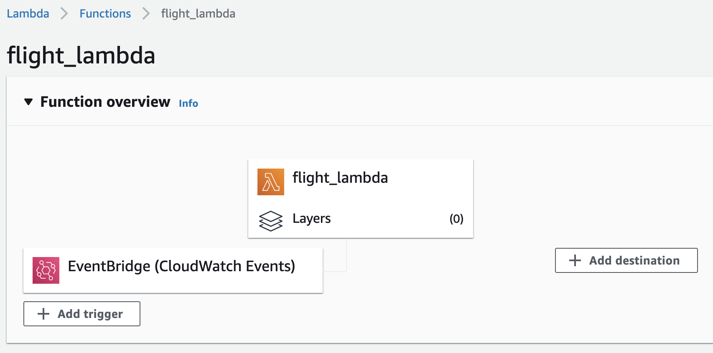
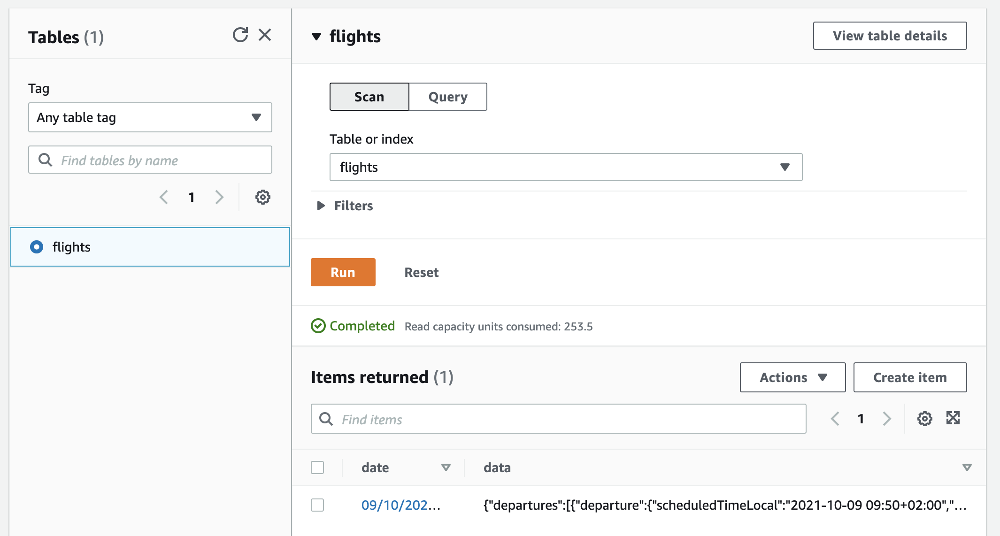

# IT-Projekt

## Aufgabe 1

### Aufgabenbeschreibung

Datenquellen identifizieren

Daten sammeln und herunterladen

Relevante Attribute extrahieren

Daten validieren (Cleaning)

#### Datequellen identifizieren

| Name | Github Referenz | Website |
|---|---|---|
| Flightradar24 | [/Flightradar24](./Flightradar24) | https://www.flightradar24.com/ |
| AeroDataBox | [/AeroDataBox](./Aerodatabox_API) | https://www.aerodatabox.com/ |

##### Schnittstellendefinition

* [Flightradar24](./Flightradar24/README.md)
* [AeroDataBox](./Aerodatabox_API/README.md)

#### Daten sammeln

##### Architekturdokumentation: AWS

Als Infrastruktur für die Datensammlung wählten wir AWS, den Cloud Service von Amazon aus. Der Code für die Datensammlung wird in AWS Lambda Funktionen ausgeführt und die Daten werden in AWS DynamoDB gespeichert. Gründe für die Wahl des Amazon Cloud Services sind folgende:
* Komfortable periodische Ausführung der Lambda Funktionen mittels EventBridge cronjobs
* Kein lokales Speichern der großen Datenmengen
* Dynamische Erweiterung des Speicherplatz
* Es wird kein zusätzlicher Rechner benötigt, der eine Woche mit der Datensammlung beschäftigt wäre
* Zuverlässigkeit der AWS Services

Wichtige Ressourcen: 

* [AWS Lambda Documentation](https://docs.aws.amazon.com/lambda/index.html)
* [AWS DynamoDB Documentation](https://docs.aws.amazon.com/dynamodb/index.html)
* [Boto3 Documentation](https://boto3.amazonaws.com/v1/documentation/api/latest/index.html)

<INSERT Screenshots AWS Lambda, DynamoDB + Architekturdiagramm>

*AWS Lambda*

*AWS DynamoDB*

Als Primary Key wurde das Datum inkl. Uhrzeit gewählt. Als Value werden die abgefragten JSON Elemente als String gespeichert. Für die einzelnen Quellen wurden jeweils verschiedene Datenbanken angelegt.

##### Flughäfen

FRA, VIE, EHAM

#### Relevante Attribute extrahieren

#### Datencleaning

## Aufgabe 2
